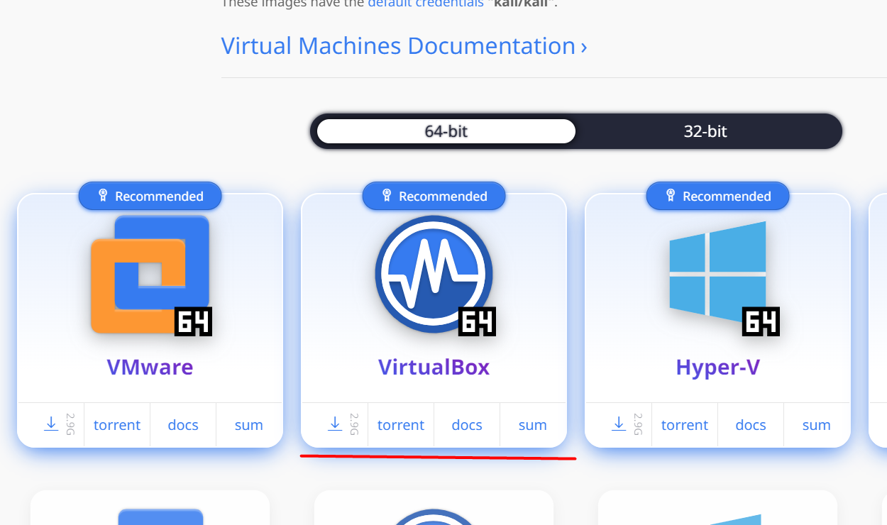
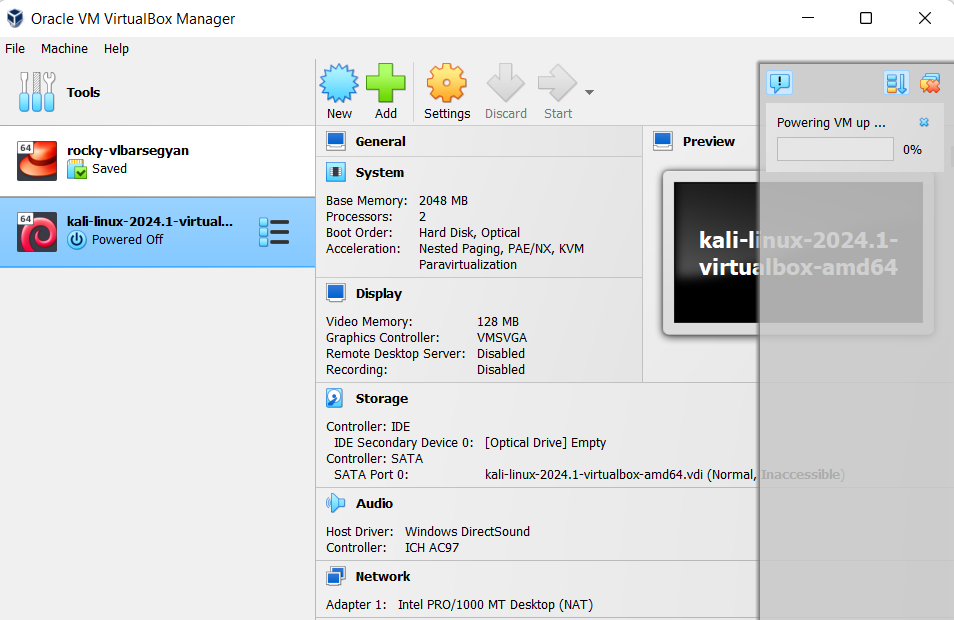
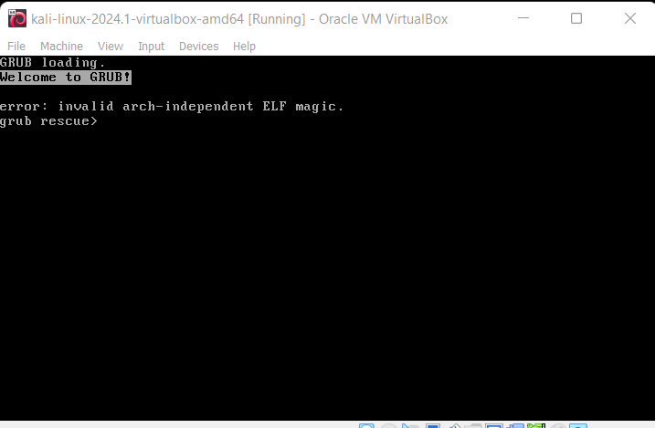
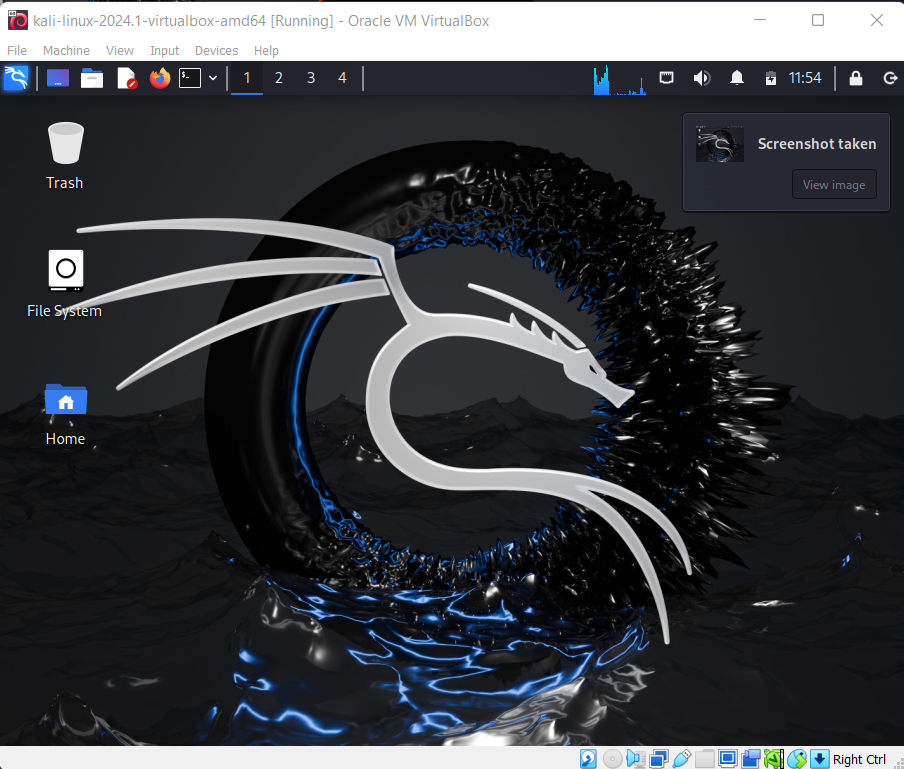

---
## Front matter
lang: ru-RU
title: Индивидуальный проект №1
subtitle: Основы информационной безопасности
author:
  - Барсегян В.Л.
institute:
  - Российский университет дружбы народов им. Патриса Лумумбы, Москва, Россия

## i18n babel
babel-lang: russian
babel-otherlangs: english

## Formatting pdf
toc: false
toc-title: Содержание
slide_level: 2
aspectratio: 169
section-titles: true
theme: metropolis
header-includes:
 - \metroset{progressbar=frametitle,sectionpage=progressbar,numbering=fraction}
 - '\makeatletter'
 - '\beamer@ignorenonframefalse'
 - '\makeatother'

## Fonts
mainfont: Arial
romanfont: Arial
sansfont: Arial
monofont: Arial
---

## Докладчик

  * Барсегян Вардан Левонович
  * НПИбд-01-22
  * Российский университет дружбы народов
  * [1132222005@pfur.ru]
  * <https://github.com/VARdamn/oib>
  
# Вводная часть

## Цели и задачи

Установка дистрибутива Kali Linux.

# Выполнение лабораторной работы

## На сайте kali.org выбираю готовую ВМ kali linux для VirtualBox

{ #fig:001 width=70% }

## Далее, извлекаю архив и запускаю .vbox файл, который добавляет новую ВМ kali linux.

{ #fig:002 width=70% }

## Запускаю виртуальную машину 

{ #fig:003 width=70% }

## При входе, ввожу логин *kali* и пароль *kali* 

{ #fig:004 width=70% }

## Вывод

Я установил виртуальную машину на дистрибутиве kali linux.