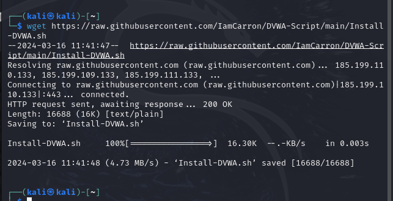
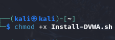
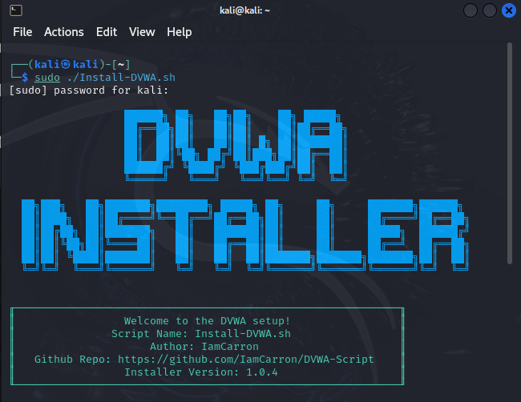
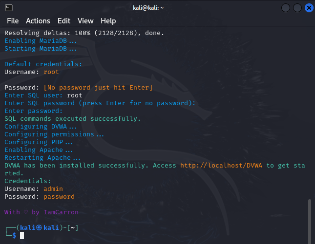

---
## Front matter
lang: ru-RU
title: Индивидуальный проект №2
subtitle: Основы информационной безопасности
author:
  - Барсегян В.Л.
institute:
  - Российский университет дружбы народов им. Патриса Лумумбы, Москва, Россия

## i18n babel
babel-lang: russian
babel-otherlangs: english

## Formatting pdf
toc: false
toc-title: Содержание
slide_level: 2
aspectratio: 169
section-titles: true
theme: metropolis
header-includes:
 - \metroset{progressbar=frametitle,sectionpage=progressbar,numbering=fraction}
 - '\makeatletter'
 - '\beamer@ignorenonframefalse'
 - '\makeatother'

## Fonts
mainfont: Arial
romanfont: Arial
sansfont: Arial
monofont: Arial
---

## Докладчик

  * Барсегян Вардан Левонович
  * НПИбд-01-22
  * Российский университет дружбы народов
  * [1132222005@pfur.ru]
  * <https://github.com/VARdamn/study_2023-2024_infosec/tree/master/project-personal>
  
# Вводная часть

## Цели и задачи

Знакомство и установка DVWA в систему Kali Linux.

# Выполнение лабораторной работы

## Открываю консоль и ввожу команду *wget https://raw.githubusercontent.com/IamCarron/DVWA-Script/main/Install-DVWA.sh* для скачивания исполняемого файла DVWA

{ #fig:001 width=70% }

## Для установленного файла добавляю права на исполнение с помощью команды *chmod +x* 

{ #fig:002 width=70% }

## Запускаю от имени суперпользователя скачанный файл командой *sudo ./Install-DVWA.sh*

{ #fig:003 width=70% }

{ #fig:004 width=70% }

## Вывод

Я узнал о DVWA и поставил ее на систему Kali Linux
