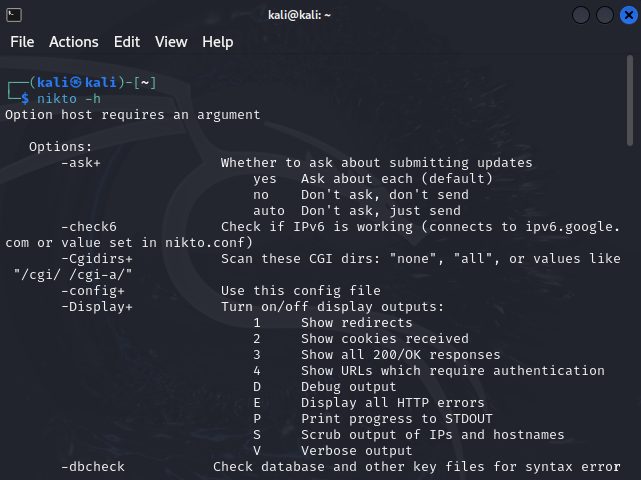
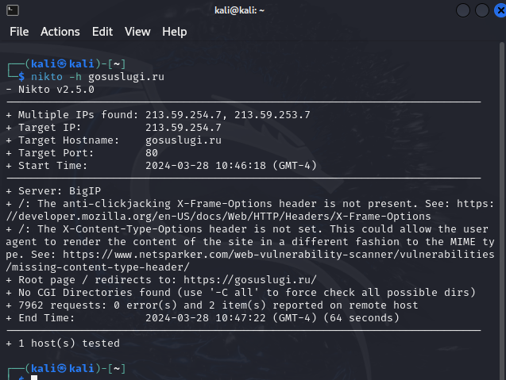
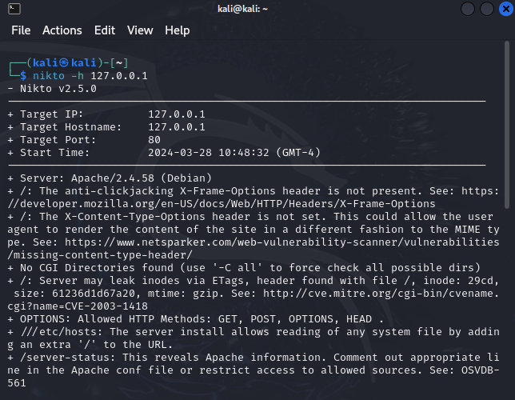
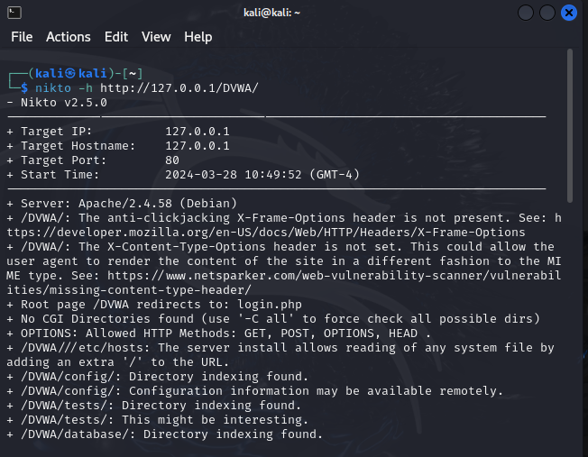

---
## Front matter
lang: ru-RU
title: Индивидуальный проект №4
subtitle: Основы информационной безопасности
author:
  - Барсегян В.Л.
institute:
  - Российский университет дружбы народов им. Патриса Лумумбы, Москва, Россия

## i18n babel
babel-lang: russian
babel-otherlangs: english

## Formatting pdf
toc: false
toc-title: Содержание
slide_level: 2
aspectratio: 169
section-titles: true
theme: metropolis
header-includes:
 - \metroset{progressbar=frametitle,sectionpage=progressbar,numbering=fraction}
 - '\makeatletter'
 - '\beamer@ignorenonframefalse'
 - '\makeatother'

## Fonts
mainfont: Arial
romanfont: Arial
sansfont: Arial
monofont: Arial
---

## Докладчик

  * Барсегян Вардан Левонович
  * НПИбд-01-22
  * Российский университет дружбы народов
  * [1132222005@pfur.ru]
  * <https://github.com/VARdamn/study_2023-2024_infosec/tree/master/project-personal>
  
# Вводная часть

## Цели и задачи

Знакомство с базовым сканером безопасности nikto, его применение.

# Выполнение лабораторной работы

## Вывожу справку об утилите nikto командой *nikto -h* 

{ #fig:001 width=70% }

## Сканирую веб-сайт gosuslugi.ru на наличие уязвимостей с помощью команды *nikto -h gosuslugi.ru*. Утилита показала отсутствие некоторых важных для безопасности заголовков 

{ #fig:002 width=70% }

## Сканирую локальный хост на наличие уязвимостей с помощью команды *nikto -h 127.0.0.1*

{ #fig:003 width=70% }

## Сканирую приложение DVWA с помощью команды *nikto -h http://127.0.0.1/DVWA*. nikto также указывает на отсутствие важных заголовков и выводит информацию о различных доступных эндпоинтах

{ #fig:004 width=70% }

## Вывод

Я познакомился с nikto, научился его применять на практике для проверки уязвимостей различных сайтов

# Список литературы{.unnumbered}

::: {#refs}
:::
