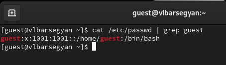
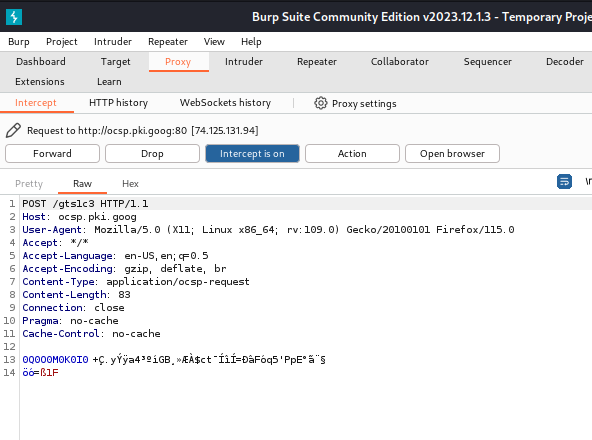
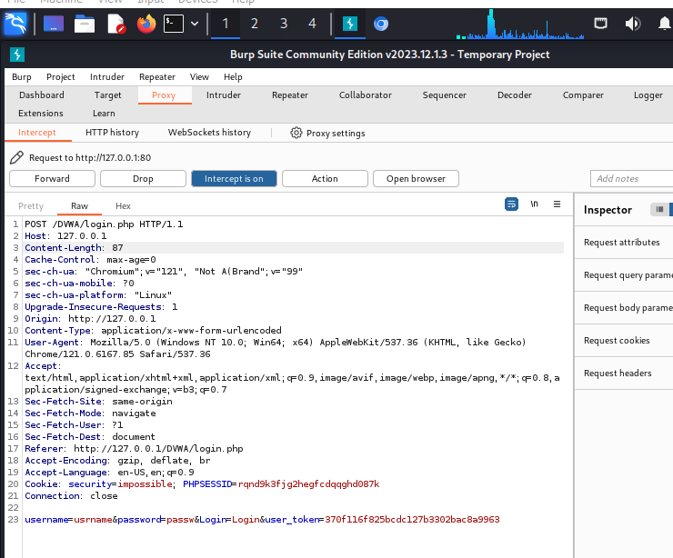
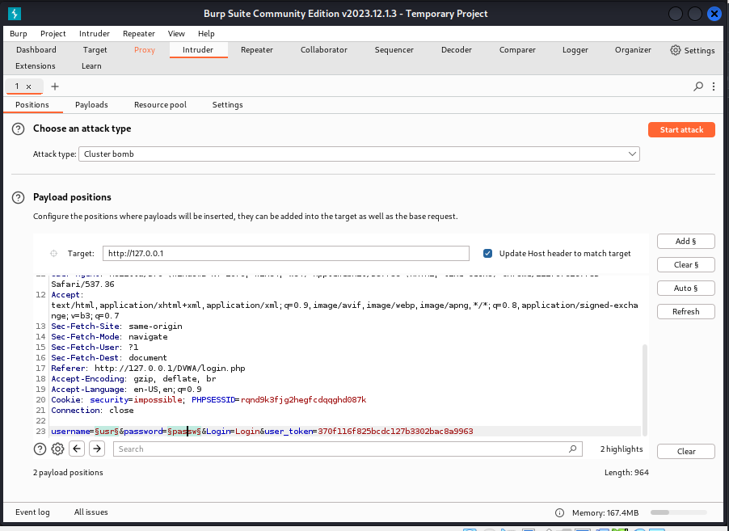
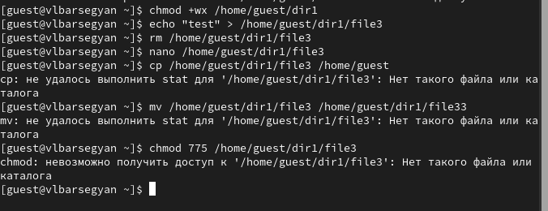
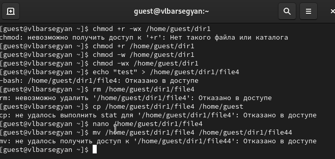

---
## Front matter
lang: ru-RU
title: Лабораторная Работа №2
subtitle: Основы информационной безопасности
author:
  - Барсегян В.Л.
institute:
  - Российский университет дружбы народов им. Патриса Лумумбы, Москва, Россия

## i18n babel
babel-lang: russian
babel-otherlangs: english

## Formatting pdf
toc: false
toc-title: Содержание
slide_level: 2
aspectratio: 169
section-titles: true
theme: metropolis
header-includes:
 - \metroset{progressbar=frametitle,sectionpage=progressbar,numbering=fraction}
 - '\makeatletter'
 - '\beamer@ignorenonframefalse'
 - '\makeatother'

## Fonts
mainfont: Arial
romanfont: Arial
sansfont: Arial
monofont: Arial
---

## Докладчик

  * Барсегян Вардан Левонович
  * НПИбд-01-22
  * Российский университет дружбы народов
  * [1132222005@pfur.ru]
  * <https://github.com/VARdamn/oib>
  
# Вводная часть

## Цели и задачи

Получение практических навыков работы в консоли с атрибутами файлов, закрепление теоретических основ дискреционного разграничения доступа в современных системах с открытым кодом на базе ОС Linux.

# Выполнение лабораторной работы

## Создаю новую учетную запись guest, используя команду *useradd guest*. Задаю для нового пользователя пароль и перехожу в него командой *su - guest*. Уточняю имя пользователя командой *whoami*. Уточняю имя пользователя, его группу, а также группы, куда входит пользователь, командой *id* 

{ #fig:001 width=70% }

## Просматриваю файл /etc/passwd командой *cat /etc/passwd | grep quest*

{ #fig:002 width=70% }

## Определяю существующие в системе директории командой *ls -l /home/*. Для guest установлены права rwx (чтение, запись и исполнение файлов). Проверяю, какие расширенные атрибуты установлены на поддиректориях, находящихся в директории /home, командой *lsattr /home*

{ #fig:003 width=70% }

## Создаю в домашней директории поддиректорию dir1 командой *mkdir dir1*. Определяю командами *ls -l* и *lsattr*, какие права доступа и расширенные атрибуты были выставлены на директорию dir1. Снимаю с директории dir1 все атрибуты командой *chmod 000 dir1* и проверяю с её помощью правильность выполнения команды *ls -l*. Пытаюсь создать в директории dir1 файл file1 командой *echo "test" > /home/guest/dir1/file1* - отказано в доступе. Проверяю командой *ls -l /home/guest/dir1*, действительно ли файл file1 не находится внутри директории dir1

{ #fig:004 width=70% }

## Меняю права директории и провожу действия с файлами для проверки

{ #fig:005 width=70% }

{ #fig:006 width=70% }

{ #fig:007 width=70% }

## Вывод

Я приобрел навыки работы в консоли с атрибутами файлов, закрепил теоретические основы дискреционного разграничения доступа в современных системах с открытым кодом на базе ОС Linux