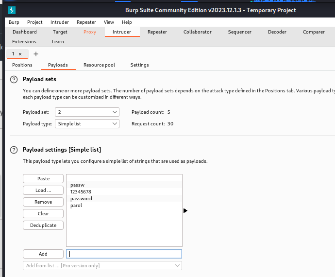
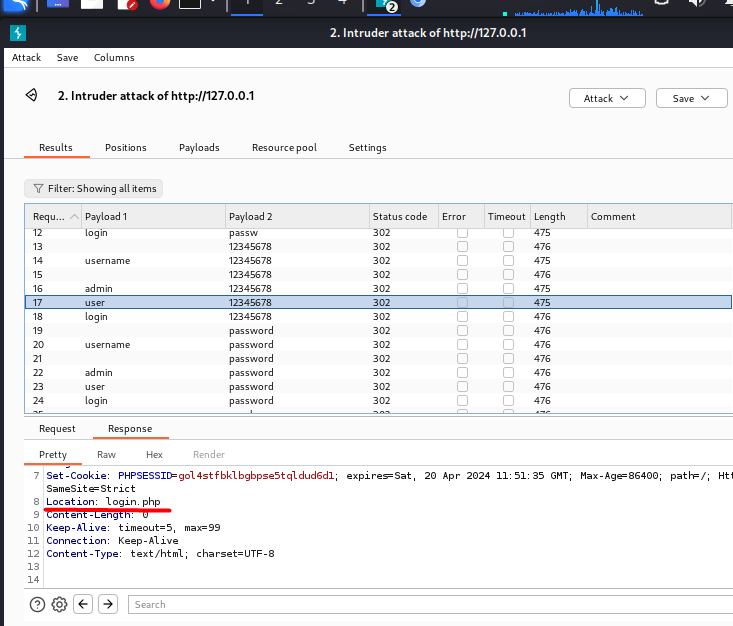

---
## Front matter
lang: ru-RU
title: Индивидуальный проект №5
subtitle: Основы информационной безопасности
author:
  - Барсегян В.Л.
institute:
  - Российский университет дружбы народов им. Патриса Лумумбы, Москва, Россия

## i18n babel
babel-lang: russian
babel-otherlangs: english

## Formatting pdf
toc: false
toc-title: Содержание
slide_level: 2
aspectratio: 169
section-titles: true
theme: metropolis
header-includes:
 - \metroset{progressbar=frametitle,sectionpage=progressbar,numbering=fraction}
 - '\makeatletter'
 - '\beamer@ignorenonframefalse'
 - '\makeatother'

## Fonts
mainfont: Arial
romanfont: Arial
sansfont: Arial
monofont: Arial
---

## Докладчик

  * Барсегян Вардан Левонович
  * НПИбд-01-22
  * Российский университет дружбы народов
  * [1132222005@pfur.ru]
  * <https://github.com/VARdamn/study_2023-2024_infosec/tree/master/project-personal>
  
# Вводная часть

## Цели и задачи

Знакомство с программой Burp Suite и изучение ее функционала.

# Выполнение лабораторной работы

## Открываю Burp Suite и во вкладке Proxy включаю перехват http-запросов

{ #fig:001 width=60% }

## В настройках браузера настраиваю прокси-сервер

{ #fig:002 width=60% }

## Теперь, трафик браузера перехватывается в программе Burp Suite. Например, при открытии веб-страницы мы видим GET-запрос к ней

{ #fig:003 width=60% }

## Отправляю POST-запрос к DVWA на авторизацию с логином *usrname* и паролем *passw*.

{ #fig:004 width=60% }

## Перехожу во вкладку intruder, выбираю тип атаки Cluster bomb. Копирую POST-запрос к DVWA из прошлого пункта и параметры username и password оборачиваю в переменные

{ #fig:005 width=60% }

## Перехожу во вкладку Payloads, и для переменной 1 (username) добавляю несколько значений. Аналогично делаю для переменной 2 (login)

{ #fig:006 width=60% }

## Нажимаю на кнопку *Start attack*, после чего посылаются POST-запросы со всеми комбинациями переменных username и password. Например, для комбинации логина и пароля user:12345678 запрос перенаправляется на страницу /login.php - значит, данная комбинация неверная

{ #fig:007 width=60% }

## Все комбинации, кроме admin:password, перенаправляются на /login.php. Комбинация admin:password перенаправляет на страницу /index.php - значит, комбинация admin:password верная

{ #fig:008 width=60% }

## Вывод

Я познакомился с Burp SUite и научился его применять на практике.

# Список литературы{.unnumbered}

::: {#refs}
:::
