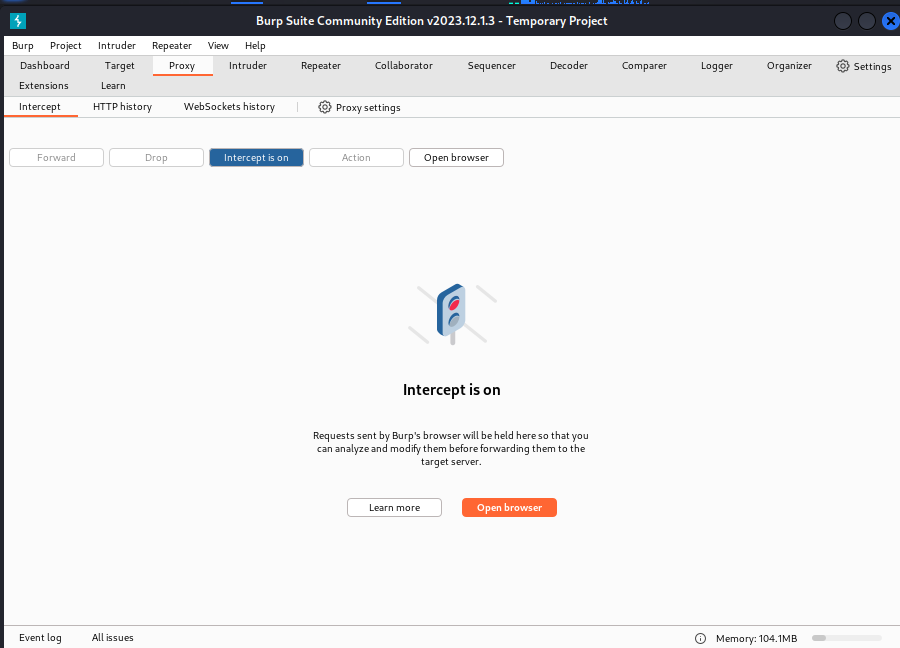

---
## Front matter
title: "Отчёт по лабораторной работе №2"
subtitle: "Дисциплина: Основы информационной безопасности"
author: "Барсегян Вардан Левонович НПИбд-01-22"

## Generic otions
lang: ru-RU
toc-title: "Содержание"

## Bibliography
bibliography: bib/cite.bib
csl: pandoc/csl/gost-r-7-0-5-2008-numeric.csl

## Pdf output format
toc: true # Table of contents
toc-depth: 2
lof: true # List of figures
lot: true # List of tables
fontsize: 12pt
linestretch: 1.5
papersize: a4
documentclass: scrreprt
## I18n polyglossia
polyglossia-lang:
  name: russian
polyglossia-otherlangs:
  name: english
## I18n babel
babel-lang: russian
babel-otherlangs: english
## Fonts
mainfont: Arial
romanfont: Arial
sansfont: Arial
monofont: Arial
mainfontoptions: Ligatures=TeX
romanfontoptions: Ligatures=TeX
sansfontoptions: Ligatures=TeX,Scale=MatchLowercase
monofontoptions: Scale=MatchLowercase,Scale=0.9
## Biblatex
biblatex: true
biblio-style: "gost-numeric"
biblatexoptions:
  - parentracker=true
  - backend=biber
  - hyperref=auto
  - language=auto
  - autolang=other*
  - citestyle=gost-numeric
## Pandoc-crossref LaTeX customization
figureTitle: "Рис."
tableTitle: "Таблица"
listingTitle: "Листинг"
lofTitle: "Список иллюстраций"
lotTitle: "Список таблиц"
lolTitle: "Листинги"
## Misc options
indent: true
header-includes:
  - \usepackage{indentfirst}
  - \usepackage{float} # keep figures where there are in the text
  - \floatplacement{figure}{H} # keep figures where there are in the text
---

# Цель работы

Получение практических навыков работы в консоли с атрибутами файлов, закрепление теоретических основ дискреционного разграничения доступа в современных системах с открытым кодом на базе ОС Linux.

# Выполнение лабораторной работы

1. Создаю новую учетную запись guest, используя команду *useradd guest*. Задаю для нового пользователя пароль и перехожу в него командой *su - guest*. Уточняю имя пользователя командой *whoami*. Уточняю имя пользователя, его группу, а также группы, куда входит пользователь, командой *id* (рис. [-@fig:001])

{ #fig:001 width=70% }

2. Просматриваю файл /etc/passwd командой *cat /etc/passwd | grep quest*
 (рис. [-@fig:002])

{ #fig:002 width=70% }

3. Определяю существующие в системе директории командой *ls -l /home/*. Для guest установлены права rwx (чтение, запись и исполнение файлов). Проверяю, какие расширенные атрибуты установлены на поддиректориях, находящихся в директории /home, командой *lsattr /home* (рис. [-@fig:003])

{ #fig:003 width=70% }

4. Создаю в домашней директории поддиректорию dir1 командой *mkdir dir1*. Определяю командами *ls -l* и *lsattr*, какие права доступа и расширенные атрибуты были выставлены на директорию dir1. Снимаю с директории dir1 все атрибуты командой *chmod 000 dir1* и проверяю с её помощью правильность выполнения команды *ls -l*. Пытаюсь создать в директории dir1 файл file1 командой *echo "test" > /home/guest/dir1/file1* - отказано в доступе. Проверяю командой *ls -l /home/guest/dir1*, действительно ли файл file1 не находится внутри директории dir1 (рис. [-@fig:004])

{ #fig:004 width=70% }

5. Меняю права директории и провожу действия с файлами для проверки (рис. [-@fig:005], рис. [-@fig:006], рис. [-@fig:007])

{ #fig:005 width=70% }

{ #fig:006 width=70% }

{ #fig:007 width=70% }

# Таблица 1

 | Права директории 	|   Права файла   	| Создание файла 	| Удаление файла 	| Запись в файл 	| Чтение файла 	| Смена   директории 	| Просмотр файлов   в директории 	| Переименование   файла 	| Смена атрибутов  файла 	|
  |:----------------:	|:---------------:	|:--------------:	|:--------------:	|:-------------:	|:------------:	|:------------------:	|:------------------------------:	|:----------------------:	|:----------------------:	|
 | d(000) 	|        (000)        	|        -       	|        -       	|       -       	|       -      	|          -         	|                -               	|            -           	|            -           	|
 | d--x------ (100) 	|        (000)        	|        -       	|        -       	|       -       	|       -      	|          +         	|                -               	|            -           	|            +           	|
 | d-w------- (200) 	|        (000)        	|        -       	|        -       	|       -       	|       -      	|          -         	|                -               	|            -           	|            -           	|
 | d-wx------ (300) 	|        (000)        	|        +       	|        +       	|       +       	|       -      	|          +         	|                -               	|            +           	|            +           	|
 | d-r------- (400) 	|        (000)        	|        -       	|        -       	|       -       	|       +      	|          -         	|                +               	|            -           	|            -           	|
 | d-r-x----- (500) 	|        (000)        	|        -       	|        -       	|       -       	|       -      	|          +         	|                +               	|            -           	|            +           	|
 | d-rw------ (600) 	|        (000)        	|        -       	|        -       	|       -       	|       +      	|          +         	|                +               	|            +           	|            -           	|
 | d-rwx----- (700) 	|        (000)        	|        +       	|        +       	|       +       	|       +      	|          +         	|                +               	|            +           	|            +           	|
 | d--------- (000) 	| --x------ (100) 	|        -       	|        -       	|       -       	|       -      	|          -         	|                -               	|            -           	|            -           	|
 | d--x------ (100) 	| --x------ (100) 	|        -       	|        -       	|       -       	|       -      	|          +         	|                -               	|            -           	|            +           	|
 | d-w------- (200) 	| --x------ (100) 	|        -       	|        -       	|       -       	|       -      	|          -         	|                -               	|            -           	|            -           	|
 | d-wx------ (300) 	| --x------ (100) 	|        +       	|        +       	|       -       	|       -      	|          +         	|                -               	|            +           	|            +           	|
 | dr-------- (400) 	| --x------ (100) 	|        -       	|        -       	|       -       	|       -      	|          -         	|                +               	|            -           	|            -           	|
 | dr-x------ (500) 	| --x------ (100) 	|        -       	|        -       	|       -       	|       -      	|          +         	|                +               	|            -           	|            +           	|
 | drw------- (600) 	| --x------ (100) 	|        -       	|        -       	|       -       	|       -      	|          -         	|                +               	|            -           	|            -           	|
 | drwx------ (700) 	| --x------ (100) 	|        +       	|        +       	|       -       	|       -      	|          +         	|                +               	|            +           	|            +           	|
 | d--------- (000) 	| -w------- (200) 	|        -       	|        -       	|       -       	|       -      	|          -         	|                -               	|            -           	|            -           	|
 | d--x------ (100) 	| -w------- (200) 	|        -       	|        -       	|       +       	|       -      	|          +         	|                -               	|            -           	|            +           	|
 | d-w------- (200) 	| -w------- (200) 	|        -       	|        -       	|       -       	|       -      	|          -         	|                -               	|            -           	|            -           	|
 | d-wx------ (300) 	| -w------- (200) 	|        +       	|        +       	|       +       	|       -      	|          +         	|                -               	|            +           	|            +           	|
 | dr-------- (400) 	| -w------- (200) 	|        -       	|        -       	|       -       	|       -      	|          -         	|                +               	|            -           	|            -           	|
 | dr-x------ (500) 	| -w------- (200) 	|        -       	|        -       	|       +       	|       -      	|          +         	|                +               	|            -           	|            +           	|
 | drw------- (600) 	| -w------- (200) 	|        -       	|        -       	|       -       	|       -      	|          -         	|                +               	|            -           	|            -           	|
 | drwx------ (700) 	| -w------- (200) 	|        +       	|        +       	|       +       	|       -      	|          +         	|                +               	|            +           	|            +           	|
 | d--------- (000) 	| -wx------ (300) 	|        -       	|        -       	|       -       	|       -      	|          -         	|                -               	|            -           	|            -           	|
 | d--x------ (100) 	| -wx------ (300) 	|        -       	|        -       	|       +       	|       -      	|          +         	|                -               	|            -           	|            +           	|
 | d-w------- (200) 	| -wx------ (300) 	|        -       	|        -       	|       -       	|       -      	|          -         	|                -               	|            -           	|            -           	|
 | d-wx------ (300) 	| -wx------ (300) 	|        +       	|        +       	|       +       	|       -      	|          +         	|                -               	|            +           	|            +           	|
 | dr-------- (400) 	| -wx------ (300) 	|        -       	|        -       	|       -       	|       -      	|          -         	|                +               	|            -           	|            -           	|
 | dr-x------ (500) 	| -wx------ (300) 	|        -       	|        -       	|       +       	|       -      	|          +         	|                +               	|            -           	|            +           	|
 | drw------- (600) 	| -wx------ (300) 	|        -       	|        -       	|       -       	|       -      	|          -         	|                +               	|            -           	|            -           	|
 | drwx------ (700) 	| -wx------ (300) 	|        +       	|        +       	|       +       	|       -      	|          +         	|                +               	|            +           	|            +           	|
 | d--------- (000) 	| r-------- (400) 	|        -       	|        -       	|       -       	|       -      	|          -         	|                -               	|            -           	|            -           	|
 | d--x------ (100) 	| r-------- (400) 	|        -       	|        -       	|       -       	|       +      	|          +         	|                -               	|            -           	|            +           	|
 | d-w------- (200) 	| r-------- (400) 	|        -       	|        -       	|       -       	|       -      	|          -         	|                -               	|            -           	|            -           	|
 | d-wx------ (300) 	| r-------- (400) 	|        +       	|        +       	|       -       	|       +      	|          +         	|                -               	|            +           	|            +           	|
 | dr-------- (400) 	| r-------- (400) 	|        -       	|        -       	|       -       	|       -      	|          -         	|                +               	|            -           	|            -           	|
 | dr-x------ (500) 	| r-------- (400) 	|        -       	|        -       	|       -       	|       +      	|          +         	|                +               	|            -           	|            +           	|
 | drw------- (600) 	| r-------- (400) 	|        -       	|        -       	|       -       	|       -      	|          -         	|                +               	|            -           	|            -           	|
 | drwx------ (700) 	| r-------- (400) 	|        +       	|        +       	|       -       	|       +      	|          +         	|                +               	|            +           	|            +           	|
 | d--------- (000) 	| r-x------ (500) 	|        -       	|        -       	|       -       	|       -      	|          -         	|                -               	|            -           	|            -           	|
 | d--x------ (100) 	| r-x------ (500) 	|        -       	|        -       	|       -       	|       +      	|          +         	|                -               	|            -           	|            +           	|
 | d-w------- (200) 	| r-x------ (500) 	|        -       	|        -       	|       -       	|       -      	|          -         	|                -               	|            -           	|            -           	|
 | d-wx------ (300) 	| r-x------ (500) 	|        +       	|        +       	|       -       	|       +      	|          +         	|                -               	|            +           	|            +           	|
 | dr-------- (400) 	| r-x------ (500) 	|        -       	|        -       	|       -       	|       -      	|          -         	|                +               	|            -           	|            -           	|
 | dr-x------ (500) 	| r-x------ (500) 	|        -       	|        -       	|       -       	|       +      	|          +         	|                +               	|            -           	|            +           	|
 | drw------- (600) 	| r-x------ (500) 	|        -       	|        -       	|       -       	|       -      	|          -         	|                +               	|            -           	|            -           	|
 | drwx------ (700) 	| r-x------ (500) 	|        +       	|        +       	|       -       	|       +      	|          +         	|                +               	|            +           	|            +           	|
 | d--------- (000) 	| rw------- (600) 	|        -       	|        -       	|       -       	|       -      	|          -         	|                -               	|            -           	|            -           	|
 | d--x------ (100) 	| rw------- (600) 	|        -       	|        -       	|       +       	|       +      	|          +         	|                -               	|            -           	|            +           	|
 | d-w------- (200) 	| rw------- (600) 	|        -       	|        -       	|       -       	|       -      	|          -         	|                -               	|            -           	|            -           	|
 | d-wx------ (300) 	| rw------- (600) 	|        +       	|        +       	|       +       	|       +      	|          +         	|                -               	|            +           	|            +           	|
 | dr-------- (400) 	| rw------- (600) 	|        -       	|        -       	|       -       	|       -      	|          -         	|                +               	|            -           	|            -           	|
 | dr-x------ (500) 	| rw------- (600) 	|        -       	|        -       	|       +       	|       +      	|          +         	|                +               	|            -           	|            +           	|
 | drw------- (600) 	| rw------- (600) 	|        -       	|        -       	|       -       	|       -      	|          -         	|                +               	|            -           	|            -           	|
 | drwx------ (700) 	| rw------- (600) 	|        +       	|        +       	|       +       	|       +      	|          +         	|                +               	|            +           	|            +           	|
 | d--------- (000) 	| rwx------ (700) 	|        -       	|        -       	|       -       	|       -      	|          -         	|                -               	|            -           	|            -           	|
 | d--x------ (100) 	| rwx------ (700) 	|        -       	|        -       	|       +       	|       +      	|          +         	|                -               	|            -           	|            +           	|
 | d-w------- (200) 	| rwx------ (700) 	|        -       	|        -       	|       -       	|       -      	|          -         	|                -               	|            -           	|            -           	|
 | d-wx------ (300) 	| rwx------ (700) 	|        +       	|        +       	|       +       	|       +      	|          +         	|                -               	|            +           	|            +           	|
 | dr-------- (400) 	| rwx------ (700) 	|        -       	|        -       	|       -       	|       -      	|          -         	|                +               	|            -           	|            -           	|
 | dr-x------ (500) 	| rwx------ (700) 	|        -       	|        -       	|       +       	|       +      	|          +         	|                +               	|            -           	|            +           	|
 | drw------- (600) 	| rwx------ (700) 	|        -       	|        -       	|       -       	|       -      	|          -         	|                +               	|            -           	|            -           	|
 | drwx------ (700) 	| rwx------ (700) 	|        +       	|        +       	|       +       	|       +      	|          +         	|                +               	|            +           	|            +           	|

# Таблица 2

 | Операция               | Минимальные права на директорию | Минимальные права на файл |
 | :--------------------: | :-----------------------------: | :-----------------------: |
 | Создание файла         | d-wx------ (300)                | (000)                     |
 | Удаление файла         | d-wx------ (300)                | (000)                     |
 | Чтение файла           | d--x------ (100)                | (000)                     |
 | Запись в файл          | d--x------ (100)                | (200)                     |
 | Переименование файла   | d-wx------ (300)                | (000)                     |
 | Создание поддиректории | d-wx------ (300)                | (000)                     |
 | Удаление поддиректории | d-wx------ (300)                | (000)                     |

# Выводы

Я приобрел навыки работы в консоли с атрибутами файлов, закрепил теоретические основы дискреционного разграничения доступа в современных системах с открытым кодом на базе ОС Linux