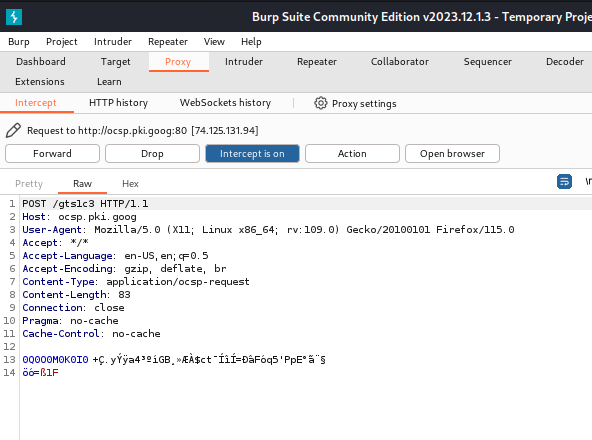

---
## Front matter
title: "Отчёт по индивидуальному проекту №5"
subtitle: "Дисциплина: Основы информационной безопасности"
author: "Барсегян Вардан Левонович НПИбд-01-22"

## Generic otions
lang: ru-RU
toc-title: "Содержание"

## Bibliography
bibliography: bib/cite.bib
csl: pandoc/csl/gost-r-7-0-5-2008-numeric.csl

## Pdf output format
toc: true # Table of contents
toc-depth: 2
lof: true # List of figures
lot: true # List of tables
fontsize: 12pt
linestretch: 1.5
papersize: a4
documentclass: scrreprt
## I18n polyglossia
polyglossia-lang:
  name: russian
polyglossia-otherlangs:
  name: english
## I18n babel
babel-lang: russian
babel-otherlangs: english
## Fonts
mainfont: Arial
romanfont: Arial
sansfont: Arial
monofont: Arial
mainfontoptions: Ligatures=TeX
romanfontoptions: Ligatures=TeX
sansfontoptions: Ligatures=TeX,Scale=MatchLowercase
monofontoptions: Scale=MatchLowercase,Scale=0.9
## Biblatex
biblatex: true
biblio-style: "gost-numeric"
biblatexoptions:
  - parentracker=true
  - backend=biber
  - hyperref=auto
  - language=auto
  - autolang=other*
  - citestyle=gost-numeric
## Pandoc-crossref LaTeX customization
figureTitle: "Рис."
tableTitle: "Таблица"
listingTitle: "Листинг"
lofTitle: "Список иллюстраций"
lotTitle: "Список таблиц"
lolTitle: "Листинги"
## Misc options
indent: true
header-includes:
  - \usepackage{indentfirst}
  - \usepackage{float} # keep figures where there are in the text
  - \floatplacement{figure}{H} # keep figures where there are in the text
---

# Цель работы

Знакомство с программой Burp Suite и изучение ее функционала.

# Выполнение лабораторной работы

1. Открываю Burp Suite и во вкладке Proxy включаю перехват http-запросов (рис. [-@fig:001])

{ #fig:001 width=70% }

2. В настройках браузера настраиваю прокси-сервер (рис. [-@fig:002])

{ #fig:002 width=70% }

3. Теперь, трафик браузера перехватывается в программе Burp Suite. Например, при открытии веб-страницы мы видим GET-запрос к ней (рис. [-@fig:003])

{ #fig:003 width=70% }

4. Отправляю POST-запрос к DVWA на авторизацию с логином *usrname* и паролем *passw*. (рис. [-@fig:004])

{ #fig:004 width=70% }

5. Перехожу во вкладку intruder, выбираю тип атаки Cluster bomb. Копирую POST-запрос к DVWA из прошлого пункта и параметры username и password оборачиваю в переменные (рис. [-@fig:005])

{ #fig:005 width=70% }

6. Перехожу во вкладку Payloads, и для переменной 1 (username) добавляю несколько значений. Аналогично делаю для переменной 2 (login) (рис. [-@fig:006])

{ #fig:006 width=70% }

7. Нажимаю на кнопку *Start attack*, после чего посылаются POST-запросы со всеми комбинациями переменных username и password. Например, для комбинации логина и пароля user:12345678 запрос перенаправляется на страницу /login.php - значит, данная комбинация неверная (рис. [-@fig:007])

{ #fig:007 width=70% }

8. Все комбинации, кроме admin:password, перенаправляются на /login.php. Комбинация admin:password перенаправляет на страницу /index.php - значит, комбинация admin:password верная (рис. [-@fig:008])

{ #fig:008 width=70% }

# Выводы

Я познакомился с Burp SUite и научился его применять на практике.

# Список литературы{.unnumbered}

::: {#refs}
:::